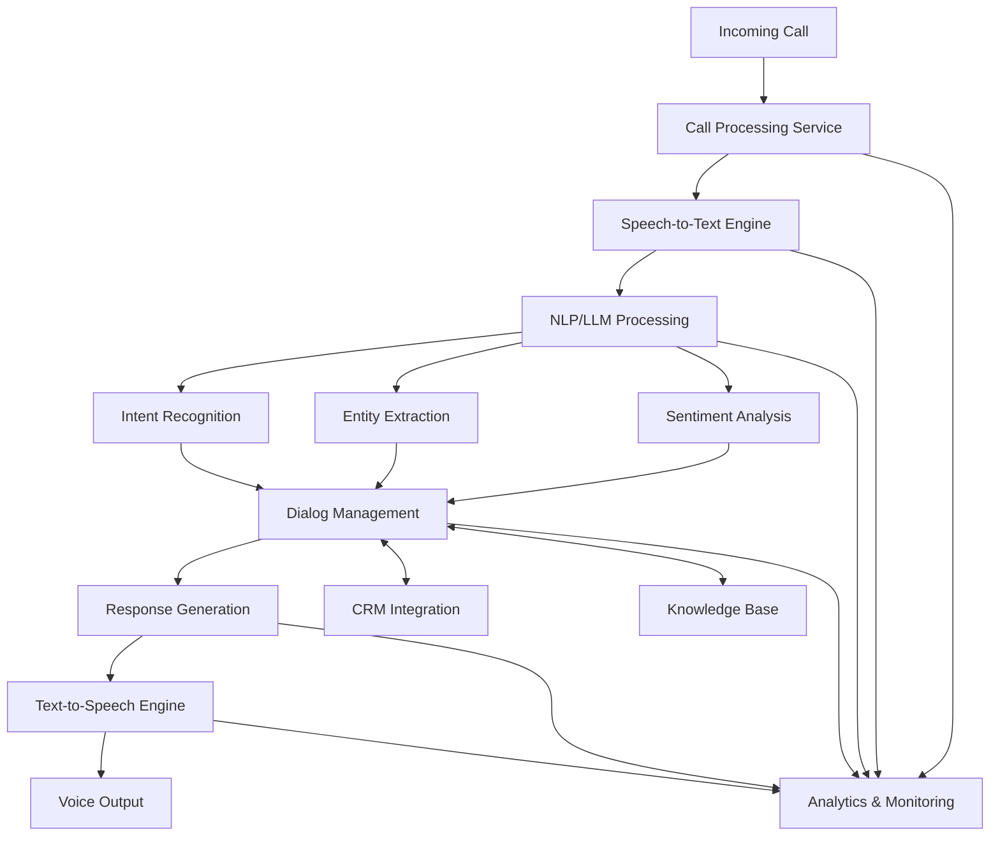

# VoiceAgent

  

## 🚀 Overview

VoiceAgent is an advanced AI-powered call automation solution developed for [Chatmantics](https://www.chatmantics.com/), a leading conversational automation platform. This system combines state-of-the-art Large Language Models (LLMs) with Speech-to-Text (STT) and Text-to-Speech (TTS) technologies to create natural, efficient, and productive phone conversations at scale.

The platform enables businesses to automate customer interactions while maintaining human-like conversation quality, resulting in higher conversion rates and lower acquisition costs across Voice, SMS, Facebook, and other channels.

<b>🔍 What is Chatmantics?</b>

Chatmantics is a conversational automation platform that allows you to plan, deploy, and integrate virtual assistants powered by AI and Natural Language Processing with your contact center. 

Chatmantics Assistants are proven to help companies drive efficient interactions that yield higher conversions and lower acquisition costs across multiple communication channels. Most deployments take less than 24 hours and seamlessly integrate with most CRMs, marketing automation platforms, email service providers, customer data platforms, and internal systems.

## ✨ Key Features

- **Advanced Speech Recognition**: 91%+ accuracy in transcribing and understanding natural speech patterns
- **Natural Voice Synthesis**: Human-like speech generation that adapts tone, pace, and style based on conversation context
- **Intelligent Conversation Flow**: Dynamic conversation management with context awareness and sentiment analysis
- **Scalable Architecture**: Handles 10,000+ concurrent calls with minimal latency
- **Seamless CRM Integration**: Connects with major CRM systems for data synchronization and automated follow-up
- **Real-time Analytics**: Comprehensive dashboard for monitoring call performance, conversion rates, and customer sentiment
- **Continuous Learning**: Improves responses and effectiveness through ongoing analysis of conversation patterns
- **Multi-channel Support**: Consistent user experience across voice, SMS, and social media channels

## 🏗️ Technical Architecture

VoiceAgent leverages a microservices architecture deployed on Fly.io for exceptional reliability and scalability:

### Key Components:

- **Speech Processing Pipeline**: Optimized STT and TTS engines with custom acoustic models
- **LLM Integration**: Fine-tuned language models for domain-specific understanding and generation
- **MLOps Infrastructure**: Automated training, validation, and deployment pipelines
- **Distributed Backend**: Horizontally scalable services with load balancing and redundancy
- **Monitoring System**: Comprehensive logging, alerting, and performance tracking

## 📊 Results & Impact

- **60% Reduction** in manual call handling requirements
- **15% Improvement** in customer satisfaction scores
- **99.9% Uptime** ensuring business continuity
- **Days vs. Weeks** for model update cycle times
- **Seamless Integration** with existing CRM and telephony systems
- **Real-time Insights** into customer sentiment and conversation effectiveness

## 💬 Testimonials

  <!--  -->
  
  <blockquote>
    
<i>"The VoiceAgent platform developed by Ruslan has transformed our business. The combination of natural-sounding voice technology with intelligent conversation management has allowed our clients to scale their operations while improving customer experience. It's rare to find someone who understands both the technical aspects and business implications of AI implementation so thoroughly."</i>

    <footer>— <b>Keith, CEO of Chatmantics</b></footer>
  </blockquote>

<b>More Customer Feedback</b>

<blockquote>
  
<i>"After implementing VoiceAgent, our response time decreased by 80% while our conversion rate increased by 25%. The ROI has been remarkable."</i>

  <footer>— <b>Sarah T., Marketing Director</b></footer>
</blockquote>

<blockquote>
  
<i>"What impressed us most was how quickly VoiceAgent adapted to our specific industry terminology and customer questions. Within days, it was handling complex inquiries with surprising accuracy."</i>

  <footer>— <b>Michael R., Operations Manager</b></footer>
</blockquote>

<blockquote>
  
<i>"The analytics dashboard gives us insights we never had before. We can now identify patterns in customer inquiries and optimize our product offerings accordingly."</i>

  <footer>— <b>Jennifer L., Product Manager</b></footer>
</blockquote>

## 🛠️ Technology Stack

## 📈 Implementation Highlights

- Developed custom fine-tuning pipelines for speech recognition models to handle domain-specific terminology
- Implemented sophisticated dialog management system with context tracking and multi-turn conversation handling
- Created automated testing framework for conversation flows with simulated user interactions
- Built comprehensive analytics dashboard for tracking key performance metrics and conversation quality
- Designed fault-tolerant architecture with graceful degradation and automatic recovery mechanisms
- Integrated with multiple third-party systems including CRMs, marketing automation tools, and telephony providers

## 🔗 Learn More About Chatmantics

For more information about how Chatmantics can transform your business communications:

- [Visit the Chatmantics website](https://www.chatmantics.com/)
- [Schedule a demo](https://www.chatmantics.com/contact)
- [Explore use cases](https://www.chatmantics.com/resources)

## 📞 Contact Information

For inquiries about VoiceAgent or to discuss potential collaborations:

- **Email**: [ruslansumko.pol@gmail.com](mailto:ruslansumko.pol@gmail.com)
- **WhatsApp**: +1 (404) 839-1154
- **GitHub**: [View more projects](https://github.com/AI-General)

---

  
© 2025 VoiceAgent for Chatmantics. All Rights Reserved.

  

    <a href="https://www.chatmantics.com/privacy">Privacy Policy</a> • 
    <a href="https://www.chatmantics.com/terms">Terms of Service</a>
  

